<!--
  This README renders at the top of github.com/esteban3114.
  It just places three self-contained animated SVGs in a terminal layout.
  GitHub strips <script> and inline style="" — the only reliable vertical
  spacing is  , and <h3> avoids the full-width underline that h1/h2 draw.
  Regenerate the art with the scripts in scripts/ (see that folder).
-->

<h3><code>esteban@github ~ $ ./contributions.sh</code></h3>

  

<h3><code>esteban@github ~ $ whoami</code></h3>

<table>
  <tr>
    <td valign="top"></td>
    <td valign="top"></td>
  </tr>
</table>

  

<h3><code>esteban@github ~ $ ./links.sh</code></h3>

